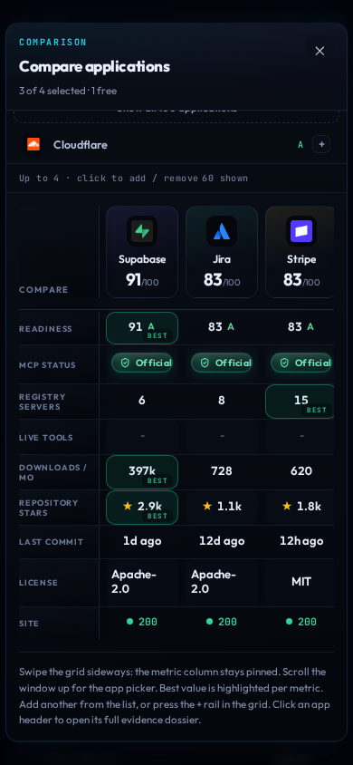
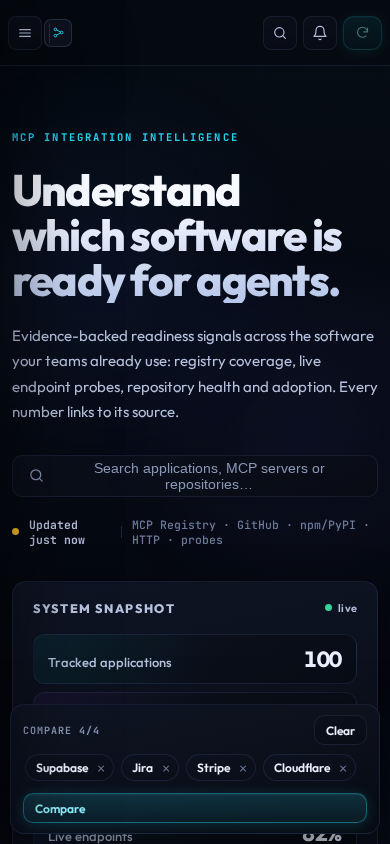

<div align="center">

# MCP Integration Explorer

**A self-updating dashboard that measures how ready 100 popular SaaS apps are for AI-agent integration over the [Model Context Protocol](https://modelcontextprotocol.io) (MCP).**

[](https://github.com/vav7/mcp-integration-explorer/actions/workflows/refresh.yml)


[**Live dashboard**](https://mcp-integration-explorer.onrender.com) · [**Portable demo**](demo.html) · [**Deploy guide**](DEPLOY.md) · [**Verification report**](VERIFICATION.md)


</div>

---

## Table of contents

- [Overview](#overview)
- [Features](#features)
- [How the readiness score works](#how-the-readiness-score-works)
- [Live results](#live-results)
- [Quickstart](#quickstart)
- [Configuration](#configuration)
- [How data stays fresh](#how-data-stays-fresh)
- [API overview](#api-overview)
- [Project structure](#project-structure)
- [Deployment](#deployment)
- [Testing](#testing)
- [Design principles and known limitations](#design-principles-and-known-limitations)
- [Screenshots](#screenshots)
- [License](#license)

---

## Overview

Most "MCP readiness" claims are vibes. This project replaces them with evidence.

It combines five real data sources into **one transparent readiness score per app**, then tracks how that picture changes over time:

| Source | What it contributes |
| --- | --- |
| Official MCP registry | Server matches, metadata, revisions |
| Live MCP endpoints | Real tool lists, auth behaviour, latency |
| npm + PyPI | Monthly download counts for MCP packages |
| GitHub API | Stars, last commit, license, archived flag |
| App websites | Reachability (availability signal) |

> **Try it without installing anything:** open [`demo.html`](demo.html) straight from disk. It is a self-contained snapshot of the dashboard with real data and no backend.

## Features

**Measure**
- Tracks **100 curated apps across 10 categories**, each with a dossier: registry matches, live tools, auth behaviour, packages, repo health and history.
- Classifies every registry server as **vendor-official**, **community** or **none** using domain verification and homepage evidence, never keyword guesses.
- Probes live MCP endpoints for real tool lists, auth gates (true 401/402/403) and latency, and excludes shared aggregator gateways from app-specific counts.
- Scores integration readiness **0-100 (grades A-E)** from six weighted signals, with the per-signal breakdown shown for every app.

**Track**
- Diffs every refresh against history: new or removed servers, tool-count changes and potential breaking changes appear in the **What-changed feed**.
- Signal wire (stock-ticker style), leaderboard, opportunities board and trends.
- Watch apps and get alerts, with an optional webhook (Slack, Discord, Zapier).

**Explore**
- **Compare deck**: put up to 4 apps side by side (works on phones too).
- **⌘K live lookup** of any app outside the curated 100, with a staged progress card (registry → handshake → repo/packages → liveness → score).
- **MCP Compatibility Tester**: runs behavioural checks (tool call, sampling, roots, protocol version) against any endpoint you point it at.
- A full **Methodology** page that explains every number on screen.

## How the readiness score works

| Signal | Weight | Source |
| --- | :---: | --- |
| Vendor-official MCP present | 0.28 | Registry classification |
| Capability (live tools exposed) | 0.14 | Endpoint probes |
| Adoption (package downloads) | 0.16 | npm + PyPI |
| Popularity (repo stars) | 0.14 | GitHub API |
| Maintenance (commit recency) | 0.16 | GitHub API |
| Availability (website up) | 0.12 | Liveness probes |

- Weights live in [`src/config.py`](src) and sum to 1.0.
- Stars and downloads use **log scales with published ceilings**, so a few giant repos cannot dwarf the rest.
- **Grades:** A 80-100 · B 60-79 · C 40-59 · D 20-39 · E 0-19

## Live results

<!-- ⚠ Keep the start/end marker comments from your current README around this block.
     scripts/update_readme_stats.py rewrites everything between them. -->

| Signal | Value |
| --- | --- |
| Apps tracked | **100** |
| Vendor-official MCP | **14** apps |
| Community MCP | **68** apps |
| No MCP found *in the registry* | **18** apps |
| Registry servers matched | **532** |
| **App-specific live tools** (from real probes) | **401** across **15** apps |
| Open endpoints / auth-gated (real 401/402/403) | **27** / **29** |
| Shared aggregator gateways detected & excluded | **12** |
| MCP package downloads | **854,230 / month** |
| GitHub repos resolved / total stars | **67** repos · **~21,000 ★** |
| Repos with a commit in the last 90 days | **45** |
| Websites responding (up) | **100 / 100** (94 clean 2xx/3xx) |
| Average readiness score | **48.5** |

*Generated from `data/live_cache.json` by `scripts/update_readme_stats.py` · last real fetch `2026-09-26T21:25:46Z` · 31 history points since 2026-09-21.*

<details>
<summary><b>Vendor-official apps</b> (domain-verified in the registry)</summary>

| App | Registry name |
| --- | --- |
| Airtable | `com.airtable/mcp` |
| Apify | `com.apify/apify-mcp-server` |
| Cloudflare | `com.cloudflare.mcp/mcp` |
| Close | `com.close/close-mcp` |
| Fathom | `ai.fathom.api/mcp` |
| Jira | `com.atlassian/atlassian-mcp-server` |
| Linear | `app.linear/linear` |
| Monday.com | `com.monday/monday.com` |
| Notion | `com.notion/mcp` |
| SE Ranking | `com.seranking/mcp` |
| Stripe | `com.stripe/mcp` |
| Supabase | `com.supabase/mcp` |
| Vercel | `com.vercel/vercel-mcp` |
| YouTube Transcript | `com.transcriptapi/youtube-transcript-and-youtube-search` |

</details>

## Quickstart

**Requirements:** Python 3.11+

```bash
git clone https://github.com/vav7/mcp-integration-explorer.git
cd mcp-integration-explorer

python3 -m venv .venv && source .venv/bin/activate
pip install -r requirements.txt

./run.sh          # serves http://127.0.0.1:8000
```

| Command | What it does |
| --- | --- |
| `./run.sh` | Starts the server with background refresh |
| `./run.sh once` | Performs a single refresh and rebuilds `demo.html`, without serving |

The repo ships with a real fetched cache, so the dashboard renders fully **before the first refresh completes**.

## Configuration

Everything is optional. Set these as environment variables.

| Variable | Default | Use it when |
| --- | --- | --- |
| `GITHUB_TOKEN` | unset | You want to lift GitHub's ~60 req/h per-IP limit (also enables open-ended repo search) |
| `EXPLORER_API_KEY` | unset | Public site: gates write endpoints behind an `X-API-Key` header |
| `NO_AUTO_REFRESH` | `0` | Read-only mirror, or several instances share one egress IP |
| `BLOCK_PRIVATE_URLS` | `1` | Keep at `1` on anything public (blocks loopback/private/link-local targets, SSRF protection) |
| `REFRESH_INTERVAL_FULL` | `900` | Tuning the background refresh cadence (seconds) |
| `ALERT_WEBHOOK_URL` | unset | Posting fired alerts to Slack/Discord/Zapier |

<details>
<summary>Abuse caps and cache tuning</summary>

| Variable | Default | Purpose |
| --- | --- | --- |
| `MAX_CUSTOM_APPS` | `200` | Cap on user-pinned apps |
| `LOOKUP_COOLDOWN_S` | `30` | Per-name cooldown on live lookups |
| `SEARCH_CACHE_MAX` | `512` | Bound on the type-ahead cache |
| `LOOKUP_CACHE_S` | `180` | How long a successful lookup is reused |
| `REGISTRY_CACHE_S` | `300` | How long a registry answer is reused |
| `UPSTREAM_RETRIES` | `2` | Backoff retries for a throttled registry call |

</details>

## How data stays fresh

- **GitHub Actions** ([`refresh.yml`](.github/workflows)) refreshes everything **every 6 hours** and commits `data/live_cache.json`, `data/history.json`, `data/changes.json`, `static/data.snapshot.js` and `demo.html` back to the repo, so the dashboard and the portable demo always open with recent real data.
- **The running server** also refreshes in the background (every 15 minutes by default) and on demand from the nav.
- **Rate limits are handled, not hidden.** Upstream 429s are retried with exponential backoff that honours `Retry-After`, responses are cached, and the UI says whose limit was hit:
  - *"Slow down, not broken"*: this app's own per-IP cooldown, with a live countdown.
  - *"Rate limited upstream"*: the registry, GitHub or npm is throttling.
- Servers that could not be re-verified in a cycle are carried over and labelled **`stale`** rather than silently dropped or silently trusted.

## API overview

| Endpoint | Method | Auth | Purpose |
| --- | --- | :---: | --- |
| `/api/health` | GET | open | Health check (`{"ok": true, …, "apps_loaded": 100}`) |
| `/api/stats` | GET | open | Aggregate statistics |
| `/api/stream` | GET (SSE) | open | Live activity feed |
| `/api/lookup` | GET | open | Live lookup of any app |
| `/api/mcp/compatibility-test` | POST | open | Behavioural check of an MCP endpoint (`{"url": "…"}`) |
| `/api/refresh` | POST | 🔑 | Trigger a refresh |
| `/api/apps` | POST | 🔑 | Pin a custom app |
| `/api/watch` | POST / DELETE | 🔑 | Manage watches |
| `/api/alerts/read` | POST | 🔑 | Mark alerts as read |

🔑 = requires `X-API-Key` when `EXPLORER_API_KEY` is set. This table lists the endpoints referenced in the deploy docs; it is not exhaustive.

## Project structure

```text
.
├── src/                  FastAPI app: fetchers, classifiers, scoring, diffing, compat tester
├── static/               The dashboard (vanilla JS + CSS, no build step)
├── scripts/              refresh_once.py · build_demo.py · update_readme_stats.py
├── data/                 Curated app list, latest real cache, history, change log
├── tests/                Regression harness
├── docs/screenshots/     Curated screenshot gallery
├── .github/workflows/    refresh.yml (6-hourly data refresh)
├── demo.html             Generated self-contained snapshot of the live data
├── DEPLOY.md             Full deployment guide
├── VERIFICATION.md       Independent verification & change report
├── Dockerfile · fly.toml · render.yaml · run.sh · requirements.txt
```

## Deployment

The app is a **single long-running Python process** (dashboard + background scheduler + SSE). It needs a host with a persistent process.
Serverless/static platforms such as Vercel or Netlify **cannot** run it.

| Platform | How |
| --- | --- |
| **Render** *(recommended)* | New + → Blueprint → select the repo. Reads `render.yaml`. |
| **Fly.io** | `fly launch --copy-config`, then add a volume so watches/alerts survive restarts. |
| **Docker / VPS** | See below. |

```bash
docker build -t mcp-explorer .
docker run -d -p 8000:8000 --restart unless-stopped \
  -e GITHUB_TOKEN=... -v mcpdata:/app/data --name mcp-explorer mcp-explorer
```

> **Free-tier note:** on Render's free plan the instance sleeps after ~15 minutes without traffic (first visit takes ~30 s to wake) and the disk is ephemeral, so watches, alerts and pinned apps reset on restart. The dataset itself reloads from the repo on boot.

Full details (env vars, health checks, TLS/proxy notes, smoke tests): **[DEPLOY.md](DEPLOY.md)**.

## Testing

The `tests/` folder is the regression harness behind [VERIFICATION.md](VERIFICATION.md): classification, registry recall, compatibility tester, diffing and rate-limit suites, plus JS and real-Chromium UI checks.

```bash
python -m pytest tests/
```

## Design principles and known limitations

**Honesty rules**

- **"None" means *not found in the registry*,** never "this app has no MCP". For example, GitHub and Netlify ship MCP servers that are not published in the registry.
- Cached results are labelled with their age; a fresh result is never labelled cached, and vice versa.
- Diffs are worded *"Potential breaking change"* until a human or a probe confirms otherwise.
- The Compatibility Tester reports **observed behaviour, not certification**.
- **No synthetic data.** The committed cache is a real fetch, and empty states say "no data yet" instead of showing zeros.

**Known limitations**

- Stars and downloads follow the repo **the registry publishes**, which for a hosted official server can be a community repo.
- The registry's search does not match multi-word queries, so multi-word brands are queried both ways plus per-token. Aggregate counts can still wobble slightly between refreshes.
- State is held in memory, so the app is **not horizontally scalable**: run one web instance, or move `data/` to a database.

## Screenshots

<table>
  <tr>
    <td align="center"><br><sub><b>Home &amp; explorer</b></sub></td>
    <td align="center"><br><sub><b>Intelligence</b></sub></td>
  </tr>
  <tr>
    <td align="center"><br><sub><b>Methodology, live</b></sub></td>
    <td align="center"><br><sub><b>Coverage &amp; readiness panels</b></sub></td>
  </tr>
  <tr>
    <td align="center"><br><sub><b>Explorer list, desktop</b></sub></td>
    <td align="center"><br><sub><b>Explorer cards, mobile</b></sub></td>
  </tr>
  <tr>
    <td align="center"><br><sub><b>Comparison deck, mobile</b></sub></td>
    <td align="center"><br><sub><b>Compare dock, 4 apps</b></sub></td>
  </tr>
</table>

## License

_No license file is present in the repository yet. Add a `LICENSE` file (MIT is a common choice for a project like this) and state it here._

---

<div align="center">
Built and maintained by <a href="https://github.com/vav7"><b>vav7</b></a>
</div>
