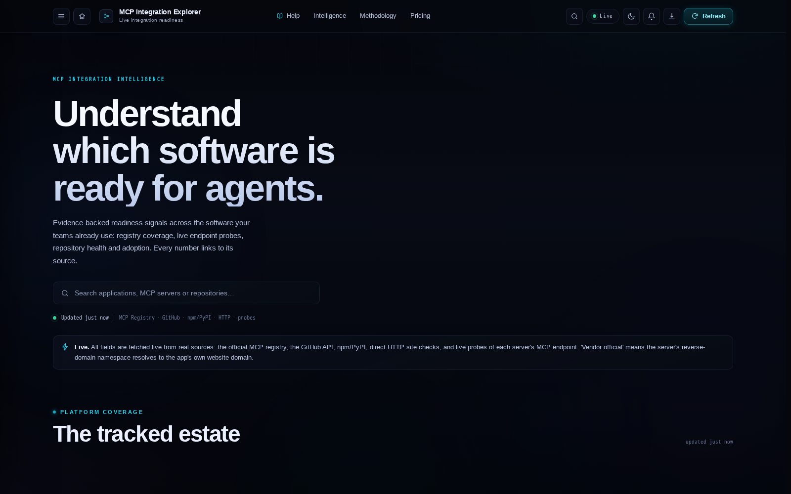
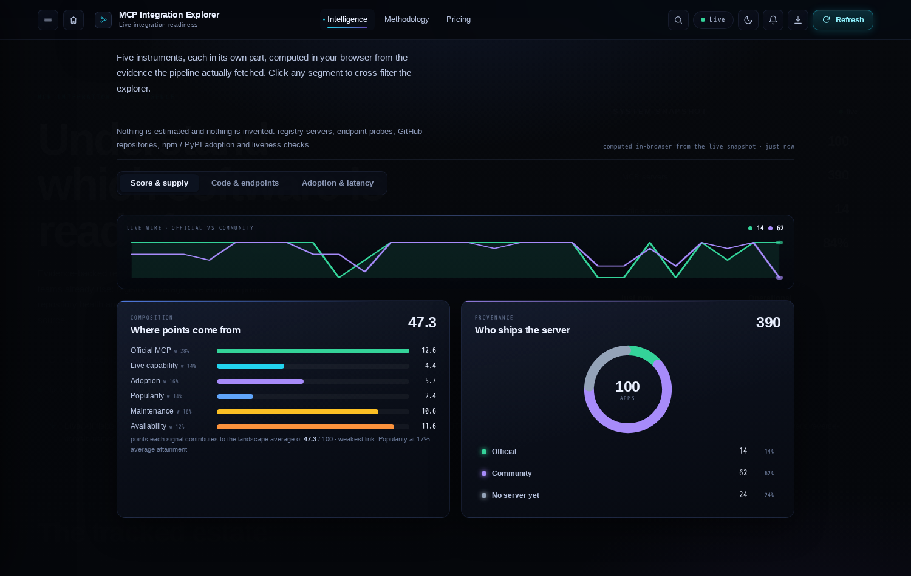
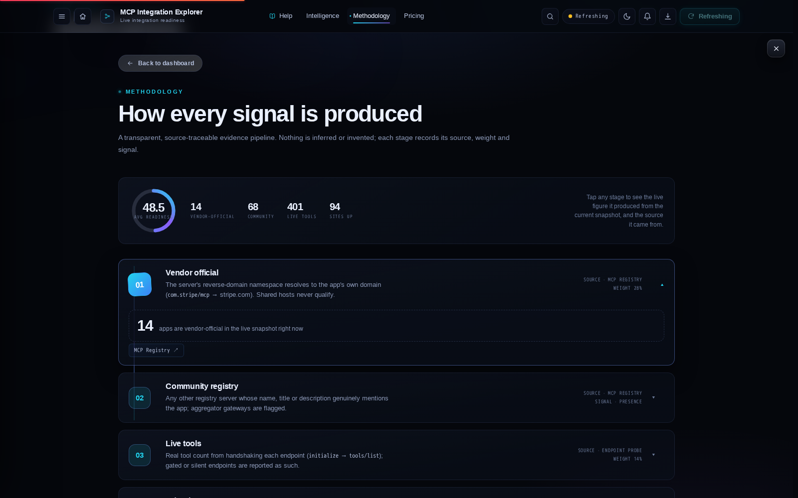
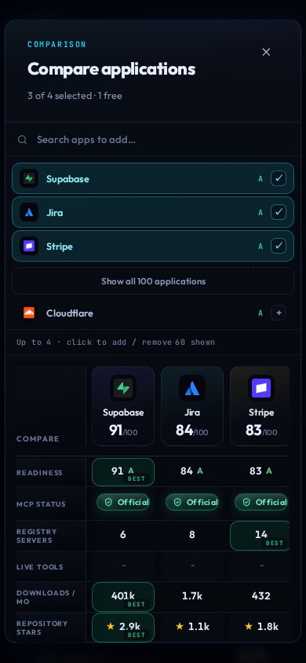
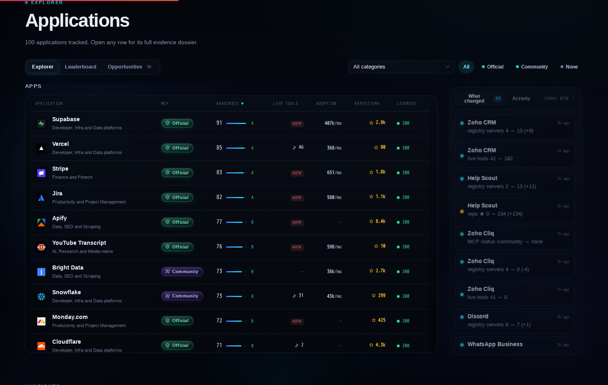
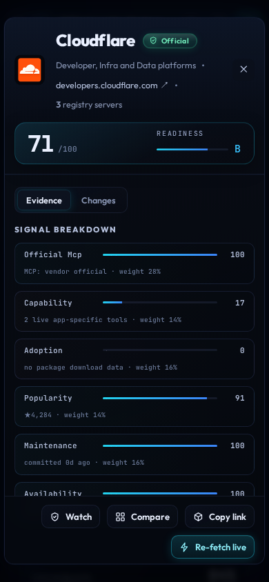
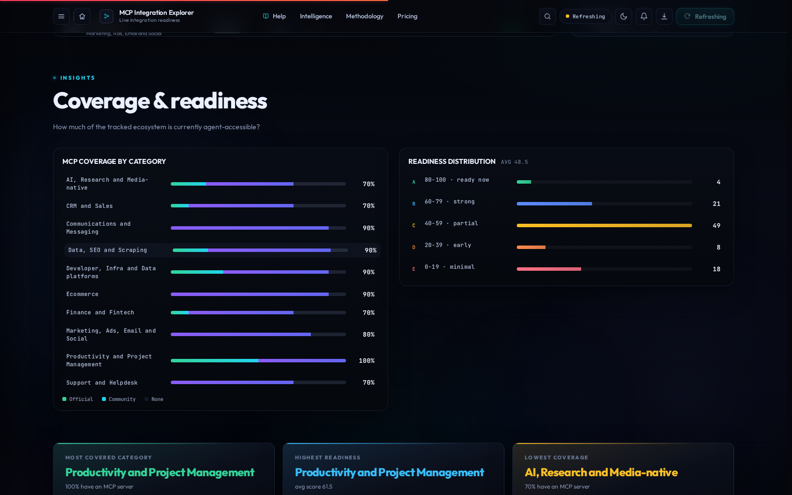
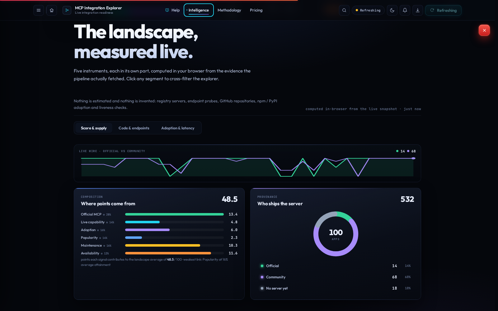

# MCP Integration Explorer

A self-updating dashboard that measures how ready 100 popular SaaS apps are for
AI-agent integration over the [Model Context Protocol](https://modelcontextprotocol.io) (MCP).
It combines the official MCP registry, live endpoint probes, npm/PyPI download
counts, GitHub repository health and website liveness into one transparent
readiness score per app, then tracks how that picture changes over time.

Live instance: <https://mcp-integration-explorer.onrender.com> ·
Portable demo: open `demo.html` straight from disk, no server needed.

| Home & explorer | Intelligence |
|:---:|:---:|
|  |  |
| **Methodology, live** | **Comparison deck on mobile** |
|  |  |
| **Explorer list, desktop** | **Explorer cards, mobile** |
|  |  |
| **Coverage & readiness panels** | **Full-screen views with pinned chrome** |
|  |  |

## What it does

- Tracks 100 curated apps across 10 categories, each with a dossier:
  registry matches, live tools, auth behaviour, packages, repo health, history.
- Classifies every registry server as vendor-official, community or none using
  domain verification and homepage evidence, never keyword guesses.
- Probes live MCP endpoints for real tool lists, auth gates (true 401/402/403)
  and latency, and excludes shared aggregator gateways from app-specific counts.
- Scores integration readiness 0-100 (grades A-E) from six weighted signals,
  with the per-signal breakdown shown for every app.
- Diffs every refresh against history: new or removed servers, tool-count
  changes and potential breaking changes appear in the What-changed feed.
- Ships an MCP Compatibility Tester that runs behavioural checks (tool call,
  sampling, roots, protocol version) against any endpoint you point it at.
- Serves a stock-ticker style signal wire, leaderboard, opportunities board,
  trends and a full methodology page that explains every number on screen.

## Readiness score

| Signal | Weight | Source |
|---|---:|---|
| Vendor-official MCP present | 0.28 | registry classification |
| Capability (live tools exposed) | 0.14 | endpoint probes |
| Adoption (package downloads) | 0.16 | npm + PyPI |
| Popularity (repo stars) | 0.14 | GitHub API |
| Maintenance (commit recency) | 0.16 | GitHub API |
| Availability (website up) | 0.12 | liveness probes |

Weights live in `src/config.py` and sum to 1.0. Stars and downloads are scored
on log scales with published ceilings so a few giant repos cannot dwarf the
rest. Grades: A 80-100, B 60-79, C 40-59, D 20-39, E 0-19.

## Live results

| Signal | Value |
|---|---:|
| Apps tracked | **100** |
| Vendor-official MCP | **14** apps |
| Community MCP | **68** apps |
| No MCP found *in the registry* | **18** apps |
| Registry servers matched | **532** |
| **App-specific live tools** (from real probes) | **401** across **15** apps |
| Open endpoints / auth-gated (real 401/402/403) | **27** / **29** |
| Shared aggregator gateways detected & excluded | **12** |
| MCP package downloads | **854,230 / month** |
| GitHub repos resolved / total stars | **67** repos · **~21,000 ★** |
| Repos with a commit in the last 90 days | **45** |
| Websites responding (up) | **100 / 100** (94 clean 2xx/3xx) |
| Average readiness score | **48.5** |

*Generated from `data/live_cache.json` by `scripts/update_readme_stats.py` · last real fetch `2026-09-26T21:25:46Z` · 31 history points since 2026-09-21.*

Vendor-official apps (domain-verified in the registry): Close `com.close/close-mcp`, SE Ranking `com.seranking/mcp`, Apify `com.apify/apify-mcp-server`, Vercel `com.vercel/vercel-mcp`, Cloudflare `com.cloudflare.mcp/mcp`, Supabase `com.supabase/mcp`, Notion `com.notion/mcp`, Airtable `com.airtable/mcp`, Linear `app.linear/linear`, Jira `com.atlassian/atlassian-mcp-server`, Monday.com `com.monday/monday.com`, Stripe `com.stripe/mcp`, Fathom `ai.fathom.api/mcp`, YouTube Transcript `com.transcriptapi/youtube-transcript-and-youtube-search`.

---

## Live data sources

| Source | Contribution | Cadence |
|---|---|---|
| MCP registry API | server matches, metadata, revisions | every refresh, cached between cycles |
| npm + PyPI | monthly download counts for MCP packages | every refresh |
| GitHub API | stars, last commit, license, archived flag | every refresh, token-aware |
| Live MCP endpoints | tool lists, auth status, latency | probed on refresh, results cached |
| App websites | reachability for the availability signal | every refresh |

## Refreshing and rate limits

- A GitHub Actions workflow (`refresh.yml`) refreshes everything every 6 hours
  and commits `data/live_cache.json`, `data/history.json`, `data/changes.json`,
  `static/data.snapshot.js` and `demo.html` back to the repo, so the dashboard
  and the portable demo always open with recent real data.
- The running server also refreshes on a schedule and on demand from the nav.
- Every upstream 429 is retried with exponential backoff before you see
  anything; a public instance throttles repeat lookups per IP to protect the
  upstream APIs, and the UI counts down instead of pretending to fail.
- Servers that could not be re-verified in a cycle are carried over and
  labelled `stale` rather than silently dropped or silently trusted.

## Honesty rules

- "None" means *not found in the registry*, never "this app has no MCP".
- Cached results are labelled with their age and the time a fresh run becomes
  available; a fresh result is never labelled cached and vice versa.
- Diffs are worded "Potential breaking change" until a human or a probe
  confirms otherwise.
- The Compatibility Tester reports observed behaviour, not certification.
- No synthetic data: the committed cache is a real fetch, and empty states say
  "no data yet" instead of showing zeros.

## Quickstart

```bash
python3 -m venv .venv && source .venv/bin/activate
pip install -r requirements.txt
./run.sh                      # serves http://127.0.0.1:8000
```

`./run.sh once` performs a single refresh and rebuilds `demo.html` without
serving. The repo ships with a real fetched cache, so the dashboard renders
fully even before the first refresh completes.

## Repository layout

```
src/        FastAPI app: fetchers, classifiers, scoring, diffing, compat tester
static/     the dashboard (vanilla JS and CSS, no build step)
scripts/    refresh_once.py, build_demo.py, update_readme_stats.py
data/       curated app list, latest real cache, history, change log
docs/       DEPLOY.md and the curated screenshot gallery
demo.html   generated self-contained snapshot of the live data
```

## Deployment

- **Render**: one-click blueprint in `render.yaml`.
- **Fly.io**: config in `fly.toml`.
- **Docker**: `docker build -t mcp-explorer . && docker run -p 8000:8000 mcp-explorer`.
- Environment variables, health checks and scaling notes: `docs/DEPLOY.md`.

Built and maintained by **vav7**.
